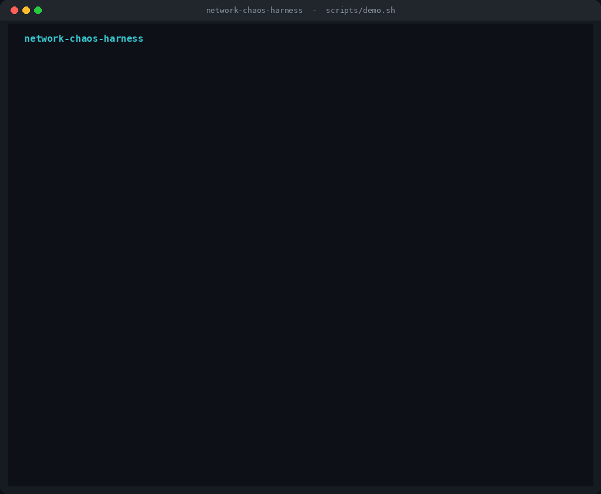
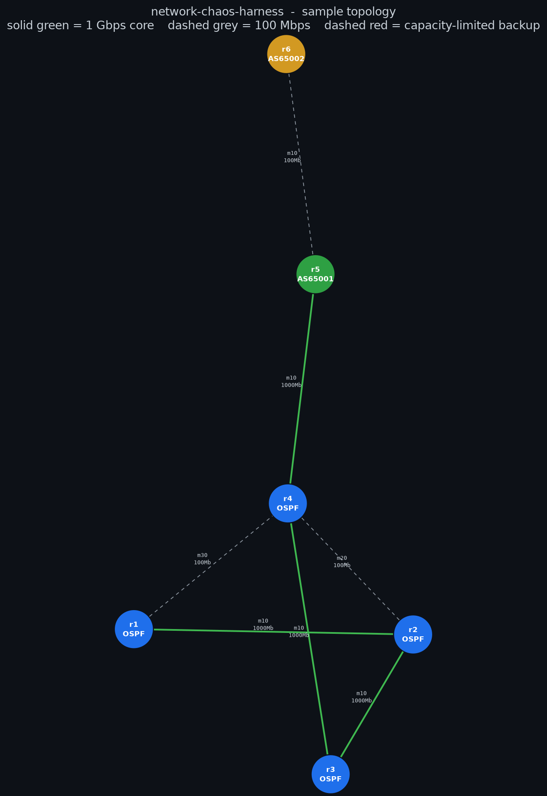

# network-chaos-harness

A GitOps-driven automated network test harness. It treats a network topology as
verifiable code: you author a topology, commit it, and a C++ chaos engine brings
up an emulated copy of the network, injects failures, and asserts that routing
reconverges correctly and within budget. The full pipeline is:

```
Design -> Commit -> Emulate -> Stabilize -> Attack -> Assert -> Report
```

The design rationale lives in [`ARCHITECTURE.md`](ARCHITECTURE.md); this README
covers building, running, and what each part does.



The topology below is rendered straight from [`topology.json`](topology.json):
node colour reflects the configured protocol set, and edge weight and colour
reflect each link's declared capacity.



## The single source of truth

Everything rotates around [`topology.json`](topology.json). It encodes only the
physical and logical graph: nodes, their protocols (OSPF area, BGP AS/peers), and
per-link capability constraints (`capacity_mbps`, `latency_ms`, `jitter_ms`,
`loss_pct`). It deliberately does **not** encode the expected converged routing
state; that is derived at test time by the `ReferenceTopologySolver`, so the graph
stays the only thing a human edits.

## Repository layout

| Path | Tier | Purpose |
|---|---|---|
| `common/` | shared | `Node`/`Link`/`Topology` model, JSON (de)serialization, deterministic address plan |
| `chaos_engine/` | Tier 4 | Parser, reference solver, exec engine, telemetry, asserter, stabilization gate, orchestrator |
| `substrate/` | Tier 3 | Mininet builder, `LinkShaper` (tc), FRR config templates |
| `visualizer/` | Tier 1 | ImGui authoring tool: graph state, canvas, git integrator |
| `.github/workflows/` | Tier 2 | CI that builds, unit-tests, and runs the live matrix as the merge gate |
| `tests/` | - | Unit tests and the §6 integration matrix |
| `third_party/` | - | Vendored fallbacks (JSON, test harness) for offline builds |

## Building

Requirements: a C++17 compiler and CMake >= 3.16. The build prefers system
packages and falls back to vendored copies when they are absent, so it works on
an air-gapped host.

Optional system packages (Debian/Ubuntu names): `nlohmann-json3-dev`,
`libpcap-dev`, `libgtest-dev`.

```bash
cmake -S . -B build -DCMAKE_BUILD_TYPE=Release
cmake --build build --parallel
ctest --test-dir build --output-on-failure
```

Dependency resolution:

- **nlohmann/json** — uses the system package if `find_package` locates it,
  otherwise the vendored header in `third_party/json`.
- **libpcap** — if present, the data-plane telemetry uses a libpcap capture
  backend; if not, it falls back to a bound-socket receiver (build define
  `HAVE_LIBPCAP`).
- **GoogleTest** — uses the system package if found, otherwise the vendored
  GoogleTest-compatible harness in `third_party/gtest`.

## Running the chaos engine

The engine reads `topology.json`, derives the expected converged state, stabilizes
the substrate, walks the §6 test matrix, writes a structured JSON report, and exits
with a POSIX status code (0 = all passed) that CI gates on.

```bash
# Off-substrate planning run: parse, solve, and validate every test case's
# pre/post-failure analysis without touching the kernel. Safe to run anywhere.
./build/chaos_engine --topology topology.json --dry-run

# Full run against a live substrate (root + Mininet + FRR; see below).
sudo ./build/chaos_engine \
  --topology topology.json \
  --report convergence_report.json \
  --convergence-timeout-ms 8000 \
  --stabilization-timeout-ms 60000
```

The report records `data_plane_convergence_ms` and `control_plane_convergence_ms`
separately for every case: these are distinct measurements (traffic resumption vs.
routing-table update) and are never collapsed into one number.

## Demo and visuals

The images above are generated, not hand-drawn. `scripts/demo.sh` drives the
engine through its lifecycle on the dry-run path and narrates each phase, printing
the topology, the per-case matrix, and the exit-code gate; every number it shows is
read back from the engine's own JSON report. The substrate-only measurements
(`data_plane`/`control_plane_convergence_ms`) are reported as `-1` in dry-run, since
they require a live host.

```bash
# Run the narrated walkthrough in your terminal.
bash scripts/demo.sh

# Regenerate every asset under media/ (topology diagram, GIF, hero still, cast).
bash scripts/make_media.sh
```

| Asset | What it is |
|---|---|
| `media/demo.gif` | Scrolling terminal capture of the full lifecycle, ending on the pass/fail gate |
| `media/demo_hero.png` | The same walkthrough as a single still image |
| `media/demo.cast` | asciinema v2 cast (`asciinema play media/demo.cast`; convert with `agg`/`ffmpeg`) |
| `media/topology.{png,svg}` | Graphviz rendering of `topology.json` |

Regenerating the diagram needs Graphviz; the GIF and still need Python with Pillow.
A recording of the visualizer authoring a topology, and a capture of the live
Mininet/FRR matrix, are best produced on a desktop host with a display and root.

## Bringing up the substrate (privileged host only)

The emulation substrate uses Linux network namespaces, veth pairs, Open vSwitch,
`tc`, and FRRouting. It requires root (or `CAP_NET_ADMIN`) and cannot run in an
unprivileged environment.

```bash
cmake --build build --target link_shaper_cli
export LINK_SHAPER_CLI="$PWD/build/link_shaper_cli"
sudo -E python3 substrate/mininet_topology.py --topology topology.json --cli
```

The Python builder reproduces the exact addressing scheme from
`common/address_plan.h`, so the engine can map observed next-hop IPs back to node
ids when asserting against the solver.

## The visualizer (optional)

The ImGui authoring tool is an optional target because it needs GLFW, OpenGL, and
a Dear ImGui checkout:

```bash
cmake -S . -B build \
  -DBUILD_VISUALIZER=ON \
  -DIMGUI_DIR=/path/to/imgui
cmake --build build --target visualizer
./build/visualizer .
```

Double-click the canvas to add routers, drag to arrange, pan/zoom the infinite
canvas, edit protocols in the side panel, then commit and push. The git
integrator captures the push exit code and surfaces an explicit success/failure
state, because that commit is the trusted trigger for the validation pipeline.

## What runs where

- **Unit tests and the dry-run integration matrix** run on any host via `ctest`.
- **The live test matrix** (kernel namespaces, FRR adjacencies, libpcap capture,
  `tc` shaping, link/node failure injection) requires a privileged host with
  Mininet, Open vSwitch, and FRRouting. The CI workflow automates this on an
  ephemeral, single-use runner, which is what makes running as root acceptable.
  See [`tests/integration/README.md`](tests/integration/README.md).
